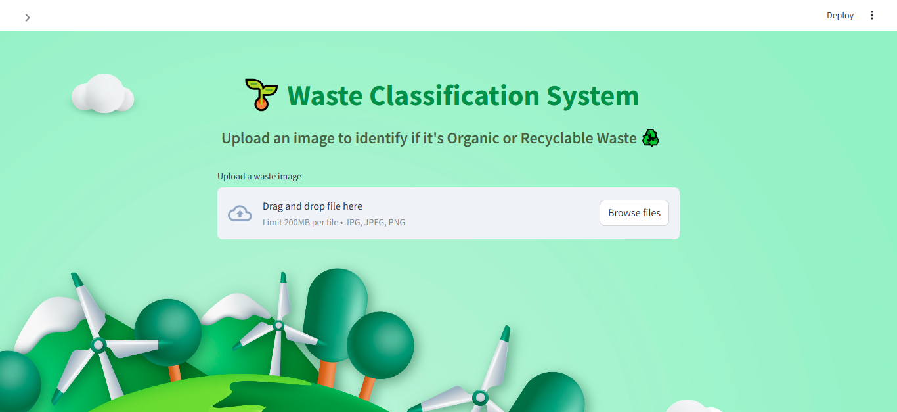
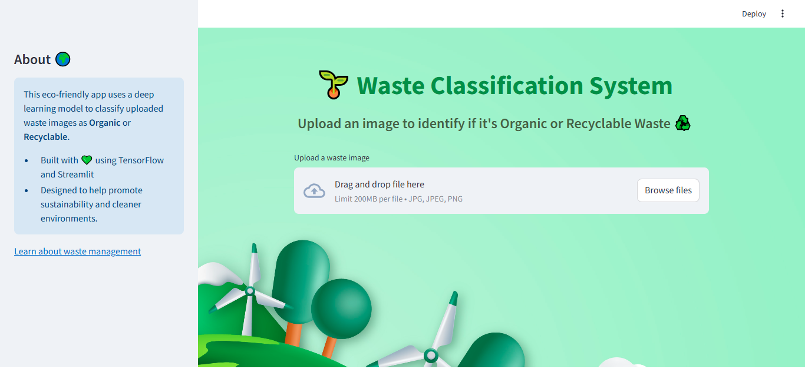
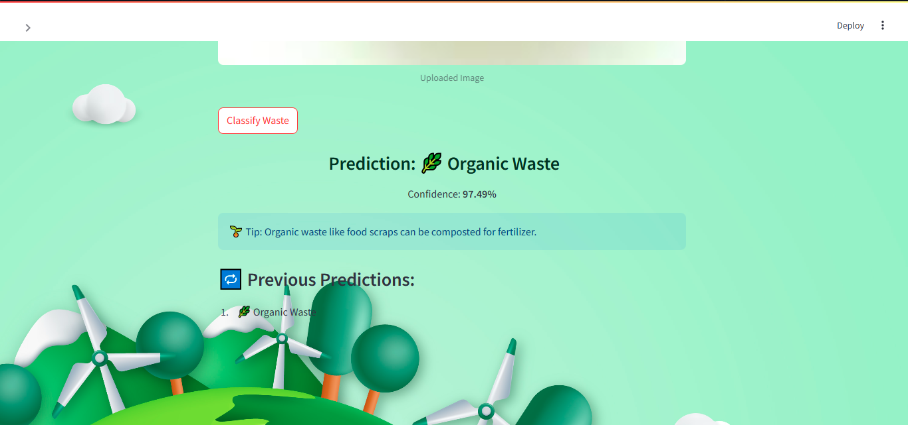
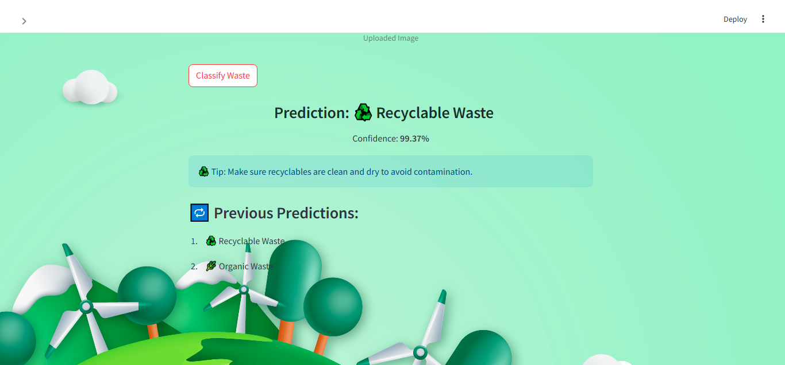

# 🌱 Waste Classification System
A deep learning-based **Streamlit web app** that classifies waste as either **Organic** or **Recyclable** using image input. Built with TensorFlow/Keras and styled with a clean, nature-friendly UI. This tool promotes sustainability and environmental awareness by making waste sorting smarter and easier.
<div align="center">
  
</div>

## 🔍 Project Overview
This system is designed to help identify and categorize waste images into two categories:
- Organic Waste 🌿
- Recyclable Waste ♻️
The user simply uploads an image, and the model predicts if the waste is organic or recyclable.

## 🚀 Features
- **Image Classification** : Classifies uploaded waste images into two categories: Organic and Recyclable.
- **Real-time Prediction** : The app provides instant feedback on uploaded waste images.
- **Custom Styling** : The web app is visually appealing with a custom background and centered buttons for better user experience.
- **Background Image** : A beautiful eco-friendly background image is used to enhance the overall aesthetics.

## 🖼️ App Preview




## 🛠️ Technologies Used
- **Streamlit** : For building the web app interface.
- **TensorFlow/Keras** : For model building and predictions.
- **OpenCV** : For image processing.
- **Base64** : For encoding and setting the background image.

## 🏗️ Project Structure
```
waste-classification-app/
├── app.py                     # Streamlit application file
├── wc_model.keras             # Trained classification model
├── images/
│   └── app_preview.png        # Screenshot of the app interface
├── waste_classification.ipynb # Jupyter notebook for model training and evaluation
├── requirements.txt           # Project dependencies
└── README.md                  # Project overview and instructions
```

## ⚠️ Note
- The machine learning model (wc_model.keras) is not included in this repository due to GitHub's file size limitations.
- To use the app, you can train your own model or request the file separately.
- 
## 📷 Demo Video

Watch the demo of the project here:
[Download and watch the demo video](https://github.com/Srilekya07/Eco-Waste-Classifier/raw/main/wc_demo.mp4)

## 🤝 Contributing
Feel free to fork the project, create feature branches, and submit pull requests.
